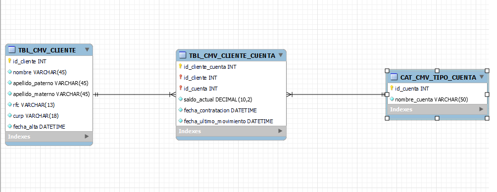

# CMV-E
El proyecto está desarrollada en las siguientes tecnologías:
- BackEnd: Node.js
- FrontEnd: React.js
- Base de datos: Mysql

Para poder probarlo seria con las especificaciones que explicaremos a continuación:
### En la parte del BackEnd

Se necesita crear una carpeta con nombre de config con un json de nombre default con las siguientes especificaciones:

``` json
 "db": {
        "host"     : "el host de la base de datos",
        "port"     : "el puerto de la base de datos",
        "user"     : "el usuario para la base de datos",
        "password" : "La contraseña si es necesaria",
        "database" : "el nombre de la base de datos con la que se trate de obtener los datos"        
    }
```
Después de generar el archivo necesitamos instalar los paquetes de node que necesitamos con el siguiente comando:
```
npm install
```

Para poder correr el proyecto se necesitará del siguiente comando:
- si se tiene instalado nodemon
```
nodemon src/index.js
```
- si no se tiene instalado el nodemon
```
node src/index.js
```

### En la parte del FrontEnd

Primero necesitamos instalar los paquetes de node
```
npm install
```
Para poder ejecutar el proyecto se necesitará del siguiente comando.
```
npm start
```

### En la parte de la base de datos
En la carpeta  DataBase encontraremos el modelo de la base de datos y el ejecutable para generar la base de datos

